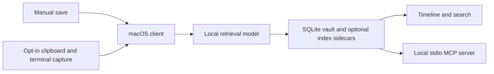

# LatticeShadow

[](https://github.com/steph4n-gh/latticeshadow/actions/workflows/ci.yml)

**A local memory for the work you were just doing.** Save a command, note, or
link; find it later by meaning or by time; optionally let an assistant read a
redacted view through a local MCP server. LatticeShadow combines a reusable
SQLite vector store with a macOS client.

This is a **development prototype**, not a finished clipboard app or a security
product. The daily-use alpha is being validated; integrated tests and selected
desktop and guest-install checks pass, while its two-hour soak and public-binary
release gates remain open. The
[capability guide](docs/CAPABILITIES.md) says exactly where the edges are.

## First run on macOS

You need Python 3.12 and the Xcode Command Line Tools. Clone the repository,
then run:

```sh
git clone https://github.com/steph4n-gh/latticeshadow.git
cd latticeshadow
make setup
source .venv/bin/activate
shadow remember terminal "Run the regression tests before releasing"
shadow timeline --source terminal
shadow search "release tests"
```

The first `shadow remember` creates a local store and downloads the pinned
retrieval model from Hugging Face. It prints the saved event's ID. To remove that
event, run `shadow forget --id YOUR_ID` and confirm the prompt. The store lives
under `~/.latticeshadow` by default. `make setup` does **not** start background
capture or edit your shell startup files. The daemon shows as stopped after a
manual save; that is expected, not a tiny rebellion.

For the complete tour and command reference, read the
[user manual](docs/USER_MANUAL.md) ([print-ready edition](docs/USER_MANUAL.html)).
The shorter path is [Getting started](docs/GETTING_STARTED.md).
If you only want the cross-platform DB package, use `make setup-db` instead;
the macOS client is not installed on Linux.

## What works, and what is still a prototype

| Area | Current state |
| --- | --- |
| Manual memory | `shadow remember`, scoped timeline and search, project assignment, and explicit forget are implemented and tested with disposable data. [Integrated synthetic recall](docs/validation/recall-local.md) passed its top-five target; the [final packaged-app 10,000-event Mini run](docs/validation/mini-b603-packaged-2026-09-23.md) met the latency target. Cold model startup takes longer. |
| Background capture | macOS clipboard and terminal capture require explicit source choices and `shadow enable`. The [final packaged app captured a synthetic copy and kept pause and source choices across an ordinary guest reboot](docs/validation/legacy-upgrade-and-lifecycle-2026-09-23.md); literal/source exclusions and optional age retention are implemented. Automatic startup after a desktop login remains to be checked. |
| Assistant access | Local project/source grants restrict a read-only stdio MCP server. An independent MCP SDK test and a synthetic Codex CLI host walkthrough pass. See the [sharing guide](docs/MCP.md). |
| Database | `latticeshadow-db` installs independently and supports document/vector storage, metadata, retrieval, and optional research indexes. |
| Desktop and peer features | The final packaged menu-bar Recall panel passed a [logged-in synthetic guest journey](docs/validation/desktop-gui.md): search, filters, preview, copy, file Open, assignment, and confirmed Forget. Cross-app shortcut behavior remains unproven. Cross-device sync, autonomous repair, and several retrieval modes remain experimental. |
| Distribution | Source releases are public. The rebuilt unsigned Apple Silicon app passed [final packaged recall and fresh-guest recovery checks](docs/validation/mini-b603-packaged-2026-09-23.md), a [logged-in GUI journey](docs/validation/desktop-gui.md), and [explicit daemon/reboot/removal checks](docs/validation/legacy-upgrade-and-lifecycle-2026-09-23.md). Populated 0.1 upgrade remains unverified after an ad-hoc-signature Keychain access failure; stock Gatekeeper, signing, and notarization evidence remain open. |

See [Capabilities and limits](docs/CAPABILITIES.md) for the evidence and privacy
boundaries behind this table. The commands above require no LLM account.

## How the pieces fit



The [architecture guide](docs/ARCHITECTURE.md) explains the storage and trust
boundaries. The `latticeshadow-db` package can be used without the macOS client
and accepts a caller-provided embedding function.

## Privacy, plainly

Background capture starts only after you choose both clipboard and terminal
history on or off, then run `shadow enable`. Both sources default to off. Use
`shadow consent wizard` to review the choices. Once enabled, capture can record personal
clipboard text and shell history. Password-manager concealment markers
are recognized, but they do not guarantee that every secret is skipped. Review
`shadow consent status` and the [capture guide](docs/GETTING_STARTED.md) first.

The local retrieval model downloads once, then runs locally. The default
configuration has no cloud LLM provider; optional sync and assistant features
can make network requests when used or configured. The client encrypts
document text, while IDs and metadata remain readable in SQLite. Its
reversible vector rotation preserves similarity geometry, so rotated vectors
are not opaque ciphertext. Key storage can fall back when platform protection
is unavailable. Simulated P2P proofs are not zk-SNARKs. There has been no
external third-party security audit.

iCloud sync writes encrypted packets while the live vault and keys stay local.
Older installations that stored their live vault in iCloud need the
[migration steps](docs/GETTING_STARTED.md) before restarting with sync enabled.

`shadow forget` removes selected events from the active local indexes.
`shadow backup export` makes a portable passphrase-encrypted snapshot, and restore goes
to a separate destination so an existing vault stays usable. Deletion is not
a promise to erase old backups, synced copies, or every trace from a filesystem.
Treat this as prototype software when choosing what to save.

## What we are trying to build

The near-term goal is dependable context recovery: know what was saved, where it
came from, find it when needed, and delete it with predictable results. That
means proving the complete save → restart → recall → forget path, making capture
and network access obvious, and measuring relevance and latency on realistic
data. We are keeping the DB usable on its own and holding the more ambitious
peer and autonomy ideas to the same evidence bar. See the [improvement sprint](docs/SPRINT.md)
for concrete acceptance criteria.

## Find your way around

| If you want to… | Read… |
| --- | --- |
| Learn the whole product, including recovery and command details | [User manual](docs/USER_MANUAL.md) or [print-ready edition](docs/USER_MANUAL.html) |
| Try the CLI, backups, or opt into capture | [Getting started](docs/GETTING_STARTED.md) |
| Share a chosen slice with an assistant | [MCP sharing guide](docs/MCP.md) |
| Check a feature's maturity or data boundary | [Capabilities and limits](docs/CAPABILITIES.md) |
| Understand the packages and data flow | [Architecture](docs/ARCHITECTURE.md) |
| Browse all guides and research notes | [Documentation index](docs/README.md) |
| Work on the code | [Contributing](CONTRIBUTING.md) |

The packages are [latticeshadow-cli](packages/cli/README.md) and
[latticeshadow-db](packages/db/README.md). Detailed implementation notes live in
their technical references; those include experimental paths and should not be
read as a list of shipped product guarantees.

## Develop and release

```sh
make test         # DB tests, plus CLI tests on macOS
make test-db
make test-cli     # macOS
make test-model   # downloads and evaluates the pinned model
make docs
```

CI runs DB tests and documentation checks on Linux. Its path selector runs the
macOS CLI suite when client code changes, and adds model, native, or app-bundle
checks when their inputs change. Documentation-only edits skip macOS. Hardware
tests that may create temporary Keychain keys are separate: `make test-hardware`.
Tags on tested `main` commits publish source-only GitHub releases without
rerunning the macOS suite.

The code is available under the [MIT License](LICENSE). Contributions are
welcome; please report security issues through [private vulnerability reporting](SECURITY.md).
