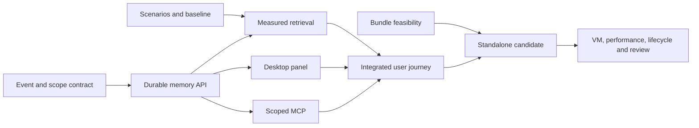

# Daily-use alpha: execution plan

Status: **candidate validation in progress; acceptance gates remain open**. Baseline: merged PR #4,
commit `ecb600da7103091b95627604850d6c0f2a09da70`. Target: the LatticeShadow 0.2
daily-use alpha. This document is the implementation handoff and coordination
contract. It turns the [improvement sprint](SPRINT.md) into one sustained campaign.

## The experience we are building

> “How did I fix that deployment problem last Thursday?”

Open a keyboard-accessible panel, find the command or note, see when and where
it came from, copy it or visit its source, and optionally share a chosen slice
with an assistant. Forgetting it removes it from every live product view.
Installing the application and restarting the machine must preserve the user's
capture choices. Remembering a command should require fewer rituals than
summoning the command in the first place.

The campaign delivers all five pieces together:

1. An approachable AppKit desktop recall panel and truthful capture controls.
2. Consistent, recoverable memory with deletion, retention, and portable backup.
3. Retrieval measured against realistic tasks and simple baselines.
4. Scoped, read-only MCP sharing with stable citations and a real client check.
5. A standalone Apple Silicon macOS application, with reproducible validation
   and an honest release-readiness report.

Reuse the existing Python, AppKit, SQLite, and embedding stack. Keep the DB
independently installable. Keep cloud sync, autonomous repair, a new UI framework,
an automatic updater, and inferred shell working directories outside this
milestone. Experimental services require explicit opt-in and stay outside the
default capture/recall path. An additional abstraction needs a demonstrated use.

## Execution model

Use **Sol for implementation**. Suggested effort: high for workers; high or
xhigh for the coordinator's migrations, integration, and final review. These
are working choices, not a measured comparison between models. The coordinator
is responsible for the outcome; agents own bounded changes and evidence.

There are four concurrent slots: **one coordinator and three workers**. Run
rolling waves, reuse agents when their next task matches their expertise, and
release slots when a task is complete. Dependencies still exist when work is
heroic.

- Coordinator works on `codex/daily-use-alpha` and keeps the integration ledger
  in this document current. Start from the plan commit on that branch, rebasing
  against current `main` if required after checking for intervening changes.
- Give every worker a separate Git worktree and `codex/alpha-<role>` branch
  based on an explicit integrated commit. Send its absolute worktree path in
  its assignment. Workers must verify branch/path before editing.
- One owner edits each file at a time. Shared-file changes are requests to the
  owner; a worker must not silently expand its write set.
- The coordinator integrates completed commits sequentially, resolves conflicts,
  and tests the resulting tree. A passing worker branch is insufficient evidence
  for the integrated product.
- Keep small, reviewable commits. Open one final implementation PR with the
  evidence ledger and unresolved gates. Batch remote pushes; do not trigger a
  full macOS run for every intermediate worker commit.
- Product implementation, tests, and a review PR belong to the execution
  campaign. Merging and publishing the public binary release require a later
  user instruction. Never put signing credentials or private lab details in Git.

### Ownership

Paths below are ownership boundaries, including proposed files that do not yet
exist. The coordinator records any transfer before both agents continue.

| Owner | Files and responsibilities |
| --- | --- |
| Coordinator | `shadow_cli.py`, `shadowd.py`, `config.py`, `consent.py` under `packages/cli/latticeshadow/`; root `Makefile`, dependency/version declarations, integration docs, final wiring and review |
| C — memory core | `packages/db/latticeshadow_db/latticedb/{collection,store,privacy}.py` and necessary adjacent DB internals/tests; CLI `timeline.py`, `vaults.py`, `rebuild.py`, `keychain.py`; focused memory/recovery helpers and tests |
| R — retrieval | New CLI `retrieval.py` only if needed; `packages/cli/evaluation/`, `packages/cli/scripts/evaluate_recall.py`, retrieval tests and authored scenario specifications; ranking and evaluation reports |
| U — desktop | CLI `menu.py`, an adjacent small UI state helper if needed, desktop tests; panel, keyboard flow, state display and screenshots |
| A — assistant | CLI `mcp_server.py`, narrowly scoped sharing-policy/redaction helper, MCP tests, `docs/MCP.md`; protocol, scope and host walkthrough |
| P — packaging/lab | `packages/cli/packaging/`, `.github/workflows/`, `scripts/validation/`, packaging tests and lab instructions; artifact, VM driver, CI/release gates |
| E — evidence | `packages/cli/scripts/validate_lifecycle.py`, lifecycle/soak tests, `docs/validation/`; fault injection, cross-surface journeys and evidence ledger inputs. May reuse R after retrieval is integrated. |

Abbreviated CLI filenames in this document are under
`packages/cli/latticeshadow/`. C owns production DB changes even if R proposes
them. U and A consume the memory API. P supplies Makefile/dependency changes to
the coordinator. E requests production fault-injection seams from the owner;
prefer subprocess control and existing boundaries to a general testing framework.

### Waves and gates

| Wave | Worker slot 1 | Worker slot 2 | Worker slot 3 | Coordinator and exit gate |
| --- | --- | --- | --- | --- |
| 0: settle seams | C: DB record/revision contract and migration fixtures | R: scenario split, current baseline, exact/keyword baselines | P: standalone bundle feasibility spike | Freeze the contracts below and limits; inventory live entry points. G0: consumers can use agreed fixtures; bundle launches in a sanitized guest and minimal-guest provisioning has started. |
| 1: build the core | C: normalized memory, recovery, retention and backup | R: scoped retrieval implementation and evaluation | U: panel and UI state against contract fixtures | Wire ingestion/lifecycle/config adapters as C publishes interfaces. G1: core API, migrations and cross-process tests pass; retrieval integrated. |
| 2: assemble product | U: finish panel against real core | A: scoped MCP and independent client | P: bundle, CI and VM driver | Integrate CLI commands, user choices and docs. G2: cross-surface journey passes and a standalone candidate exists. |
| 3: prove and review | E: failure/lifecycle/performance/soak evidence | P: artifact install/upgrade/UI lab checks | Available U/A/C agent: independent review then assigned fixes | G3: ledger populated for the frozen candidate; fix failures and rerun affected gates. Open review PR. |

Work that depends on a contract may use fixtures until its provider lands, but
the coordinator must never mark fixture-only behavior implemented. Packaging
starts early because native Python dependencies can invalidate a pleasant plan
quite efficiently. If py2app fails the spike, P records the concrete failure and
proposes the smallest viable bundling alternative before the coordinator changes
the recipe. Source installation does not satisfy the standalone-app requirement.



## Shared contracts: freeze at G0

These are design contracts to implement, not descriptions of existing APIs.
Use the existing functions in `timeline.py`; keep compatible wrappers for current
callers until they migrate. Add the minimum public DB record/candidate-filter API
needed to replace private SQL access. No additional long-running memory service.

### Events and scopes

```python
# JSON-safe shape; existing collection/last_accessed fields may remain.
event = {
    "id": "event_8b749acf-4c48-486f-b503-bdb254c17fba",
    "type": "note",
    "source": "manual",
    "timestamp": "2026-09-17T14:03:00Z",  # occurrence time
    "captured_at": "2026-09-17T14:03:02Z",  # ingestion time
    "project": "deployments",  # None means Unassigned
    "text": "The remembered note or command",
    "metadata": {"timestamp_inferred": False},
    "score": None,  # ranking score when searching; never confidence
}

# projects=None means unrestricted; projects=() means match nothing.
# projects=(None,) explicitly selects Unassigned. Sources follow the same
# unrestricted/empty distinction, with string source names only.
scope = {
    "projects": ("deployments",),
    "sources": ("manual", "terminal"),
    "since": "2026-09-17T00:00:00Z",  # inclusive
    "until": "2026-09-18T00:00:00Z",  # exclusive
}
```

- New events receive collision-resistant IDs. Preserve existing IDs through
  migration, backup, and rebuild. Repeated identical text can be separate events.
  An explicitly supplied retry ID is idempotent for the same event; conflicting
  payloads with that ID raise an error instead of overwriting data. Compare
  caller-supplied fields; an omitted occurrence timestamp reuses the original
  value on retry. Generated ingestion times/inference flags are not payload changes.
  Adding a previously deleted ID fails: preserve minimal durable deleted-ID
  bookkeeping through rebuild and current-snapshot backup/restore. A deliberate
  new capture gets a new ID. Restoring an older backup can restore older records,
  which is the documented historical-backup exception.
- Accept timezone-aware input and normalize to UTC. Legacy occurrence time falls
  back to insertion time with an inference flag. Unknown source remains unknown.
  Terminal history alone cannot prove working directory, project, or exit status.
- Project labels are explicit strings; no project registry is needed. New automatic
  capture is Unassigned unless the user explicitly selected a capture project.
  Manual save and later assignment can set it. No foreground-project guessing.
- Authoritative ID/source/project/timestamp arguments cannot be overridden by
  arbitrary metadata. Bound text and metadata sizes at input; G0 records exact
  limits and user-visible failures before consumers implement them.
- The initial alpha keeps existing metadata-at-rest limitations explicit. Store
  only necessary provenance; source/time/project/path metadata can remain visible
  on disk. Do not claim whole-vault encryption or add ambient provenance capture.
  Text decryption failures must be explicit errors, never ciphertext masquerading
  as successfully decrypted text.

### Memory functions and semantics

The coordinator and C freeze concrete Python types at G0 with examples for
success, empty results, invalid input and storage/model failure. Required surface:

```text
add_event(vault, event_type, text, *, source, timestamp=None,
          project=None, metadata=None, doc_id=None) -> event_id
fetch_events(vault, *, scope, limit=20, cursor=None) -> EventPage
search_events(vault, query, *, scope, limit=10) -> list[Event]
get_events(vault, ids, *, scope) -> list[Event]
assign_project(vault, ids, project) -> changed_count
forget_events(vault, ids) -> ForgetResult
```

- `EventPage` contains `events` and `next_cursor`. List order is occurrence time
  descending then ID; use keyset pagination, with scope-bound cursors. Each page
  uses current canonical data; it does not promise a snapshot across user edits.
- Scope restricts the candidate set **before** ranking, pagination and limits.
  Apply it identically in CLI, desktop and MCP. Empty scope intersections return
  no data. Validate bounds, enums, types and limits rather than silently ignoring
  them. Direct ID reads also enforce scope.
- Every result is hydrated from canonical records at read time. Missing canonical
  IDs must never fall back to text cached in a hot/derived index. A read beginning
  after a completed deletion or scope revocation cannot return that content.
- `ForgetResult` distinguishes canonical deletion, derived invalidation/cleanup,
  and errors. Successful forget makes records unavailable to all subsequent live
  product reads. Derived files must be cleaned or invalidated immediately and
  repaired safely on reopen; report any incomplete physical cleanup honestly.
- Capture succeeds when the canonical transaction commits. A derived-index failure
  produces a visible repair state and must not create duplicate events on retry.
- Use SQLite transactions plus a small revision/locking discipline for writers,
  readers' caches and sidecar replacement. Verify multiple existing processes see
  each other's changes. Do not rely on file size to establish index freshness.
- Stable citation URI: `latticeshadow://event/<encoded-id>`. Every resolution
  rechecks existence and current scope. The MCP response for missing/out-of-scope
  IDs does not reveal which condition applies. OS-wide URI registration is not
  required; the MCP resource and desktop ID lookup are sufficient for this alpha.

### Lifecycle and sharing

Coordinator owns a small common capture-status/control entry point consumed by
CLI and U. It returns actual daemon health, consent requirement, per-source enable
flags, explicit pause state, and actionable errors. Pause blocks capture and
persists across reboot without erasing source choices; resume respects consent.
Disabling stops background operation. No UI-only toggles or always-Active label.

A owns sharing policy; coordinator wires its local CLI/UI configuration. A grant
contains an ID/revision, explicit project allowlist (Unassigned only if selected),
allowed sources, optional fixed UTC bounds, and a result cap. No grant means no
memory reads. Resolve relative dates when creating a grant. A server started with
one grant never broadens beyond its startup ceiling: each request intersects that
ceiling, the current locally stored grant and the request's narrower scope.
Deletion/revocation takes effect on subsequent requests. Widening requires a new
local grant/server launch. Preview displays the eligible records and their count;
it does not imply that already shared content can be withdrawn from an assistant.

## Workstream deliverables

### C: memory people can trust

- Route clipboard, terminal, manual and active production ingestion through the
  normalizer. Preserve PR #4's opt-in consent and persistent enable/disable behavior.
- Make legacy-vault migration repeatable, preserve unknown fields needed for
  compatibility, and reject incompatible model/schema combinations explicitly.
- Correct cross-process cache freshness, rebuild concurrency and deletion across
  canonical/hot stores. Retention uses the same delete path. Add explicit age-based
  retention, disabled by default; define age using occurrence time with the legacy
  fallback. User-controlled source/content exclusions apply before persistence.
  Use bounded literal content rules initially; avoid unsafe arbitrary regex cost.
- Keep experimental immune/repair/swapper behavior behind explicit opt-in. First
  audit their effective defaults; do not assume constructor calls prove activity.
- Provide encrypted portable backup and restore as described below, including
  failures. Keep capture disabled throughout new-destination recovery.

Portable recovery contract:

1. Export a consistent canonical snapshot: IDs, type/source, occurrence/ingestion
   timestamps, project, metadata, relevant record fields, deleted-ID bookkeeping
   and source model identity.
   Exclude derived indexes, local keys, consent, settings, logs and sync state.
2. Use existing `cryptography` authenticated encryption and an established password
   KDF, with fresh salt/nonce and authenticated version/header. No custom cipher
   or bespoke chunk protocol. For alpha, cap plaintext archive payload at 256 MiB,
   document the memory cost, and reject excessive input/KDF parameters before
   expensive allocation. Increase the limit only with measured memory evidence.
3. Strictly authenticate/decrypt source records; abort on an unreadable record
   with its ID and no private text. Current permissive decryption must be corrected.
   Take passphrases through a prompt or controlled descriptor, never argv/logs.
   No plaintext temporary export. Write encrypted output privately and rename
   only after success. Python memory is not guaranteed securely erasable.
4. Authenticate the archive before parsing. Validate schema, sizes, timestamps,
   counts and duplicate IDs. Restore to a **new/empty destination** in a private
   staging database whose document text is encrypted, with a destination key and
   an explicit available model; metadata retains the limitations described above.
   Rebuild indexes. Preserve source model identity as provenance. Rankings need
   not be byte-identical after a model change.
5. Isolate destination key selection from the legacy global Keychain entry.
   Reuse a compatible key only deliberately; never overwrite the old vault's
   key while creating its replacement. Test destination reopen after a crash.
   Automatic replacement/merge of a populated live vault is outside this alpha;
   the existing vault must remain usable on every failure path.
6. Show the verified restored vault and explicit activation instructions. Restore
   must not enable capture, login startup, assistant sharing or synchronization.
   Test on a fresh VM without access to the original key or Keychain entry.

Forget/retention guarantees cover live product records and derived indexes.
They do not erase older backups, original source files, SQLite remnants on disk,
or content previously given to another application. Document this at the action.

### R: retrieval with a scorecard

- Build compact authored synthetic work scenarios for commands, notes, URLs,
  exact identifiers, paraphrases, duplicates, obsolete instructions, scope filters
  and questions with no answer. Track specifications and labels; generated
  corpora/databases/embeddings/raw reports stay ignored in `benchmark_results/`.
- Split whole scenario/project families before tuning: at least 100 development
  queries and 250 held-out queries (200 answerable, 50 unanswerable). Freeze labels
  before tuning; record justified corrections. This is an evaluation discipline,
  not a claim that a public fixture is secret or representative of every user.
- Compare the shipped path, exact cosine with the same pinned model, and a simple
  keyword baseline on identical records/scopes. Current privacy-mode hybrid search
  tokenizes encrypted text; resolve that correctness issue before calling it lexical
  retrieval. Use an in-memory lexical representation if needed; avoid introducing
  a persistent plaintext text/term index. Measure its startup and memory cost.
- Prefer the simplest approach meeting quality/performance targets. An exact
  implementation is acceptable if measured results support it. Preserve generic
  DB APIs and offer explicit rebuild/migration for a changed client index.
- Report hit@5, MRR@10, per-scenario failures, duplicates, filter correctness and
  no-answer behavior separately. Only report nDCG when graded labels exist.
  Search scores are ranking values, not probabilities. An abstention threshold
  requires development-set tuning and held-out false-positive/false-negative
  measurements; returning nearest neighbors alone is not no-answer detection.
- Use the actual encrypted vault and model for product evidence. Keep approximate
  vector agreement benchmarks separate from relevance evaluation.

### U: the desktop path

- One AppKit panel from menu and configurable keyboard shortcut. Empty query
  shows recent events. Add project/source/time filters, snippets, readable preview,
  provenance and stable IDs. Unassigned is a visible choice.
- Copy, open supported web links, reveal source files, assign project and confirmed
  forget. Copy is the default keyboard action. Never execute a recalled command;
  validate URL schemes and use argument-safe platform APIs for actions.
- Use bounded background search, debounce and request-generation checks. Old
  results cannot replace a new query/filter state or reappear after deletion.
  Actions bind to selected IDs. Invalidate stale previews after changes.
- Show loading, no matches, model/storage errors, stopped/paused/consent-needed
  and actual capture state. Provide a menu fallback when shortcut permission or
  registration fails. Notifications must not expose remembered text on lock screens.
- Remove the holographic-index prerequisite from ordinary recall; reuse one query
  path. Stop continuous animation while hidden or remove it from the core panel.
- Produce real guest screenshots and an interaction log covering keyboard flow,
  preview, filtering, copy, forget, consent and pause. Mocked AppKit tests cover
  logic; they cannot establish that the actual panel is usable.

### A: assistant access with boundaries

- Default interface is read-only and requires a user-created grant. Enforce scope
  on tools, resources, prompts, summaries, context and direct evidence lookup.
  Remove forget/repair creation, repair queues and broad privacy diagnostics from
  this default assistant surface. A model-supplied confirmation word grants nothing.
- Return structured events with stable references, timestamps, necessary allowed
  provenance and an explicit redaction indicator. Apply bounded recursive redaction
  to allowed nested metadata as well as text; omit unrelated metadata fields.
- Treat stored text as untrusted data. The server executes no commands embedded in
  memories. Client instructions can help resist prompt injection but cannot promise
  an assistant will ignore all hostile text.
- Validate JSON-RPC shapes/tool arguments, message size and result caps; document
  and negotiate the supported protocol. Handle malformed input, EOF, disconnect
  and broken pipes; keep diagnostics on stderr. Use current official MCP protocol
  documentation and an independently maintained SDK client for verification.
- Test the installed stdio server from that client, then demonstrate one real
  assistant host recalling and citing synthetic data. Record client/host versions,
  configuration and a sanitized transcript. An unavailable host leaves this gate
  pending; a handwritten JSON-RPC test does not replace it.
- Document that sharing scope is application policy. The MCP process has local
  user privileges and can open the vault; this is not a process sandbox or a
  cryptographic boundary against another tool with filesystem access.

### P: installable app and economical CI

- Early spike: use py2app and the existing AppKit entry point to launch a standalone
  arm64 `.app` containing Python, CLI/DB, PyObjC, native library and real embedding
  runtime. Start minimal/stock guest provisioning during this spike. The current
  CI base contains development tools: first test a sanitized environment, inspect
  packaged-library dependencies, and launch outside the checkout. Final standalone
  validation requires a genuinely minimal guest without Homebrew/Python/compiler;
  sanitizing PATH alone cannot establish that independence.
- Prefer a ZIP or DMG with an explicit CLI installation action. Verify GUI, daemon,
  CLI and MCP entry points; working-directory independence; resources/model cache;
  login start/stop; install and upgrade without enabling capture. Exercise the
  existing `.app`/SMAppService path instead of assuming it works.
- Bundle the pinned model for offline first use after verifying redistribution
  rights and recording licenses/size. If redistribution or a measured packaging
  constraint prevents this, record the evidence and implement an explicit model
  download with progress/failure/retry; update the offline claim and its tests.
- Freeze Python 3.12/arm64 build inputs and dependency constraints for the app.
  Keep library dependency policy separate. Reconcile supported Python versions
  with inexpensive Linux tests or honest declared support. State the tested macOS
  floor; do not claim universal binaries or untested older OS compatibility.
- CI: Linux owns DB/docs/metadata/deterministic checks. Keep conservative macOS
  gating for runtime/shared DB/dependency/build changes; skip docs/report-only
  changes. Test the path classifier on representative changed-file sets. Unknown
  paths run the required checks. Model-heavy and Swift checks depend on their
  relevant inputs; all run for a release candidate. Preserve an aggregate required
  status so skipped jobs do not leave PRs stuck or accidentally bypass failures.
- Cache pinned dependencies/model by relevant lock/revision inputs; retain
  cancellation of superseded runs. Keep privileged secrets out of untrusted PR
  execution. Never make the personal Mini an unrestricted public-PR runner.
- CI builds and verifies the bundle, then retains a small report tied to its
  commit SHA; it does not upload an unsigned app from a public PR. The private
  lab archives and checksums the exact bundle used for guest tests. A later
  binary release must verify its trusted workflow and revision, then validate
  the final signed artifact before publication.

### E: evidence and the remote lab

- Use isolated data roots, synthetic clipboard/history and subprocess boundaries.
  Test crashes before canonical commit, after commit/before derived update, and
  during delete, rebuild and restore. Assert committed data survives, IDs remain
  stable, retries are safe, and deleted events never resurrect.
- Check a reader opened before another process writes/deletes, concurrent writers,
  index loss, wrong keys, malformed backups, wrong passphrases, disk exhaustion,
  incompatible model/schema and interrupted upgrades. Source records and an
  existing vault remain usable when an operation fails.
- Run the complete journey: remember → desktop find/copy → scoped MCP cite →
  desktop forget → MCP reference unavailable → restart → still unavailable.
- Benchmark 10,000 representative events. Report separate cold model/download,
  warm embedding, retrieval and total query time; p50/p95, RSS, file descriptors,
  disk size, hardware/OS, dependency/model revision, warm-up/query counts and SHA.
- Provide 15-minute smoke and 2-hour candidate soak profiles with synthetic
  capture/query/delete/restart, resource samples and durable progress logs. Freeze
  workload and resource budgets after the baseline at G0; at minimum require no
  unbounded queue, descriptor, thread or child-process growth. A longer 24-hour
  observation is useful additional evidence and must record actual elapsed time.

The existing remote Mini can host disposable macOS guests. Use private connection
configuration supplied in the task context; public scripts take a host/guest
parameter and contain no personal SSH aliases, keys or absolute machine paths.
Preserve the existing base image and host services. Clone for fresh install; use
a separate guest for upgrade from the actual PR #4 version/state. Run one guest
at a time, disable host clipboard sharing, and stop guests in cleanup/finally paths.
Use artifact installation, not an editable source checkout, for final evidence.

The coordinator grants **one exclusive lab lease** covering guest creation,
start/stop, UI interaction, performance and soak. During wave 3, E prepares local
fault tests while P installs/verifies the artifact; P then hands the frozen
candidate and lab lease to E. Performance/soak runs must not overlap another
build or guest workload on the Mini. Transfer the lease explicitly, including
current VM state and any required cleanup.

The existing CI image has Gatekeeper disabled. It cannot prove first launch of a
quarantined signed application. A stock guest with Gatekeeper enabled and usable
Developer ID/notarization credentials is a distinct release gate. Automate guest
UI/TCC checks remotely where possible; physical attendance is unavailable. Record
an unautomatable prompt as pending evidence with a precise reproduction, while
continuing other work. Hardware-enclave/biometric claims require hardware tests.
If minimal/stock guest provisioning is unavailable, both the final standalone
install claim (P1) and Gatekeeper claim (P2) retain pending evidence as applicable.

## Acceptance and evidence ledger

The coordinator fills this table during implementation. Every pass needs a commit
SHA, command/profile, result and report location. Raw generated artifacts stay
outside Git; sanitized summaries can live in `docs/validation/`. Rows began
**planned** and move only with evidence. The numerical targets are commitments to measure, not
predictions. Fix failures or report them; never lower a target after seeing scores
just to turn the table green.

| ID | Required result | Evidence | State |
| --- | --- | --- | --- |
| M1 | Stable IDs and correct occurrence/ingestion times across sources, migration and rebuild | Current source `20669ff`: DB 228 and CLI 242 tests pass, including timeline/rebuild contracts | Passed locally |
| M2 | Filters correct before ranking/limits; zero excluded records returned | Current CLI/UI/MCP tests pass; current `20669ff` [packaged GUI smoke](validation/desktop-gui.md) exercised project filter. Preceding `b603442` packaged journey exercised source/project filters and excluded-record empty state; earlier guest checks covered Unassigned and time filters. | Passed locally; current packaged project filter passed |
| M3 | Cross-process writes/deletes/rebuilds stay consistent; no resurrection after fault/restart | Current `20669ff`: `validate_lifecycle.py lifecycle --report benchmark_results/alpha-lifecycle-20669ff.json` 12/12 on Mac16,8, macOS 27.0; raw report ignored; driver SHA-256 `a102971832a53b397d53e2ab7355a72840235f69f660f82ea8924dc53cf33c15` | Passed locally on current source |
| M4 | Retention/exclusions/consent/pause behave as documented; experiments off by default | Current CLI suite covers consent epochs, read-time clipboard revocation, retention, and pause/resume; exact `20669ff` [stripped-guest run](validation/packaged-app-20669ff-2026-09-23.md) proved pre-enable exclusion, later-copy capture, pause, and source choices across a normal reboot. A paused copy added no event. | Passed in source and current stripped guest |
| M5 | Portable recovery preserves canonical fields in fresh guest without source key; failures leave old vault usable | Current `20669ff` ZIP [exported and restored its own synthetic archive across fresh guests](validation/packaged-app-20669ff-2026-09-23.md), preserving two retained canonical events and one tombstone. It also restored a `b603442` archive. Wrong passphrases created no destination and left the successful restores usable. | Passed on current candidate artifact |
| R1 | Hit@5 at least 90% on 200 held-out answerable queries; 50 no-answer cases reported separately | `44482e8`; `evaluate_recall.py` 0.960 hit@5, 0.888 MRR@10; [scorecard](validation/recall-local.md) | Passed locally |
| R2 | Warm user-visible search p95 below 500 ms over 10,000 events on the Mini; cold cost reported separately | Exact current `20669ff` ZIP [packaged MCP run](validation/packaged-app-20669ff-2026-09-23.md): 100 full calls, p95 289.19 ms, cold first 5.4 s | Passed on current candidate artifact |
| U1 | Actual keyboard/menu → filter/preview/copy/open/assign/forget flow works; stale searches cannot overwrite state | Current `20669ff` [installed guest smoke](validation/desktop-gui.md) passed menu/Recall/search/project filter/preview/Copy/consent controls. Preceding `b603442` passed file Open/assign/confirmed Forget and observed latest rapid-query result. Cross-app shortcut and deterministic visual out-of-order completion race remain unproven. | Partial; full current GUI/keyboard/race pending |
| A1 | Every MCP surface enforces grant; scope widening/revocation/direct-ID/nested-secret cases pass | `0af8643` focused MCP tests 8/8; independent SDK and cross-surface checks described in [MCP guide](MCP.md) | Passed locally |
| A2 | A real assistant host retrieves and resolves a citation in the allowed scope | `7b7ba5d`; synthetic Codex CLI walkthrough in [MCP guide](MCP.md) | Passed locally |
| P1 | Standalone app works without development tools; install/upgrade/uninstall preserve chosen state | Current `20669ff` ZIP [build and stripped-guest checks](validation/packaged-app-20669ff-2026-09-23.md) passed offline recall, safe shred wording, query, restore, daemon/consent/reboot/remove, plus a [logged-in GUI smoke](validation/desktop-gui.md). Preceding `b603442` passed the fuller GUI. Populated 0.1 upgrade failed after ad-hoc signature replacement while 0.2 preserved key/vault; even reinstalled 0.1 failed. Signed stable-identity migration remains unverified. | Partial; full current GUI and signed upgrade pending |
| P2 | Final signed/notarized artifact opens under stock Gatekeeper/quarantine | Current app is unsigned; credentials and stock-guest check not yet supplied | Pending external signing |
| E1 | Integrated cross-surface journey and 2-hour candidate soak pass; resource behavior reported | Current `20669ff` source CLI/MCP/delete/restart lifecycle passed 12/12 and [packaged GUI smoke](validation/desktop-gui.md) passed. Preceding `b603442` full packaged desktop journey passed; its 7,200-second core-path source soak is in progress. Current-revision elapsed soak remains separate. | Pending predecessor soak and current full journey |
| E2 | Standard suites/docs, model tests, native/build checks and final independent review pass for integrated change | Current `20669ff`: DB 228 (unchanged core), CLI 242, real model 2, docs and CI selector 7 pass locally; native release build passed at `dd079b3`; exact current app verifier passed 307 linked binaries. Independent review findings were addressed. PR CI pending. | Local pass; PR CI pending |

A 24-hour soak is optional additional release evidence, with its own pending/pass
entry if started; the 2-hour result must never be described as multi-day testing.
MCP no-answer quality, peak memory/disk use and archive size limits belong in the
report even when no universal numerical gate is justified.

Completion states:

- **Ready for implementation review:** all code/docs delivered, tests and available
  lab runs executed, every acceptance row has passed, failed or specifically pending
  evidence, and unresolved limitations are prominent in the PR. Failures are not
  silently deferred features.
- **Daily-use alpha validated:** all required functional, retrieval, lifecycle,
  desktop/client and standalone artifact rows pass for the candidate. P2 may remain
  explicitly pending for a local unsigned test artifact; it blocks public release.
- **Public binary release ready:** every required row, including P2, passes for the
  final artifact; install instructions, support limits, licenses/checksums and
  recovery instructions match it. User approves publication separately.

Credentials, real-client availability and elapsed wall-clock time can leave
evidence pending. They do not justify stubs, skipped implementation or invented
passing results. Continue all independent work before requesting a missing input.

## Commands and handoffs

Existing gates remain `make test-db`, `make test-cli` on macOS, `make test-model`,
and `make docs`. Hardware tests remain opt-in. Add only the small command surface
needed for reproducibility; suggested names are proposals until implemented:

```text
make eval-recall              # deterministic scenario generation + real-model scorecard
make eval-performance         # explicit reference-machine run, not a flaky CI assertion
make test-lifecycle           # disposable subprocess/fault scenarios
make soak-smoke               # bounded 15-minute profile; candidate profile uses 2 hours
make build-app                # standalone artifact and manifest
make verify-app               # architecture/resources/entry points/checksum
python scripts/validation/macos_vm.py --artifact <path> --profile fresh
python scripts/validation/macos_vm.py --artifact <path> --profile upgrade
```

Cheap deterministic smoke cases belong in normal tests; avoid a second test
orchestration framework. The coordinator checks exact commands and prerequisite
handling before documenting them as available. Re-run broad suites at integration
boundaries and the final candidate; after a targeted fix, repeat gates covering
its concrete risk rather than spending macOS minutes on unrelated changes.

Every worker assignment includes:

```text
Worktree / branch / base SHA:
Owned files:
Outcome and acceptance IDs:
Frozen interfaces and prerequisites:
Allowed commands / isolated data root:
Required validation and report destination:
Do not edit files owned by other workers; send interface change requests.
Return commit SHA(s), changed files, commands/results, unresolved cases,
and any migration/privacy/compatibility consequences. Never claim an unrun check.
```

At each gate the coordinator records: integrated SHA; agent ownership changes;
contract decisions; completed acceptance IDs; outstanding fixes/external evidence;
the next three bounded assignments. This permits recovery after context compaction
without sending agents back to rediscover the repository.

### Copyable implementation handoff

> Execute `docs/ALPHA_PLAN.md` on the `codex/daily-use-alpha` integration branch.
> Use Sol and sub-agents, with one coordinator and at most three workers in
> isolated worktrees. Read AGENTS.md and the plan, inspect current Git/PR state,
> then implement the entire daily-use alpha campaign. Start with G0 contracts,
> evaluation baselines and the bundle feasibility spike; follow the ownership and
> dependency gates. Preserve consent, public-history hygiene and independent DB
> installation. Integrate and validate real behavior across CLI, AppKit and MCP;
> use the remote Mini only through the authorized private lab configuration.
> Complete all available implementation and evidence, record blocked external
> gates honestly, and open a review PR with the acceptance ledger. Do not merge
> or publish the release. Do not stop after scaffolding, mocks or the first
> successful workstream.

## Integration log

- Planning baseline: three independent planning reviews covered memory/durability,
  desktop/MCP, and evaluation/packaging. Contracts and ownership reconciled here.
  Follow-up review clarified retry/deletion bookkeeping, staging protection,
  exclusive lab ownership and minimal-guest evidence.
- Coordinator commits `6fc96f6` and `a7d6aec` add persistent capture pause,
  observable status, atomic config writes, and explicit consent gates for optional
  background services. CLI suite: 168 passed, 5 deselected; focused follow-up:
  40 passed, then 4 changed-risk cases passed. Documentation check passed.
  These prove the affected local behaviors, not the entire M4/desktop gate.
- G0 working contract: text at most 1 MiB UTF-8, metadata at most 64 KiB JSON,
  ID/source/project at most 256 UTF-8 bytes; fetch limit 1–500, search 1–100,
  direct get/forget at most 1000 IDs. `fetch_events` returns `{events,next_cursor}`;
  `forget_events` returns `{canonical_deleted,derived_invalidated,cleanup_errors}`.
  C is implementing and testing this contract in its isolated worktree.
- R's first synthetic baseline found top-five hit rates of 0.76 for shipped
  encrypted hybrid, 0.895 for exact cosine, 0.92 for in-memory keyword, and
  0.96 for development-tuned fusion on 200 held-out answerable queries.
  The authored fixture, report and retrieval code are still on R's worker branch;
  none of these numbers satisfies R1 until integrated and independently rerun.
  Development negatives did not support a useful abstention threshold, so
  results must remain labeled suggestions rather than confident answers.
- P has exclusive Mini access for its bundle feasibility spike. py2app initially
  hit modulegraph recursion while scanning the Python model stack; the revised
  build is being measured. P1/P2 remain open.
- G0 and most G1 code is integrated through `d9d81d3`: canonical event records,
  tombstones, scoped timeline pagination, strict decryption, cross-process
  revision handling, portable encrypted backup, explicit project assignment,
  capture exclusions, opt-in age retention, desktop panel, and CLI adapters.
  `57e1c8b` adds a revision-stamped sidecar manifest for equal-size interrupted
  writes. Integrated DB suite: 227 passed before that manifest; C reports 228
  after it. Integrated CLI suite: 202 passed, 5 hardware tests deselected
  before the final app-launch adapter; its focused test passed. R's frozen
  scenario fixture and evaluator are integrated; C is wiring its ranker into
  the canonical scoped search. These results are code checks, not completed
  cross-surface, guest, performance or soak gates.
- U's panel commit `31b7340` has 19 focused tests and a local AppKit
  construction smoke. Logged-in guest interaction and screenshots remain U1
  work after P releases the exclusive Mini lease. A is implementing grants and
  read-only scoped MCP against the integrated API. P has an offline bundle
  build/verification smoke; minimal-guest and Gatekeeper evidence remain open.
- The integrated retrieval path at `44482e8` scored 0.960 hit@5 and 0.888
  MRR@10 on 200 held-out real-model questions. All 50 no-answer questions
  received suggestions; the result is not an abstention claim. The same
  commit's synthetic lifecycle driver passed 12 subprocess/fault and
  CLI/MCP/delete/restart checks. Codex CLI completed a scoped recall and live
  citation resolution on synthetic notes at `7b7ba5d`.
- Independent review found three privacy/lifecycle defects: concurrent grant
  edits could restore a revoked grant, concurrent config edits could undo a
  pause, and the daemon could replay terminal commands from a paused interval.
  `21c6212`, `f9943b3`, and `0af8643` serialize edits and track terminal
  consent transitions, including a rapid off/on between daemon polls.
- The stripped guest installed the exact `7b7ba5d` app and saved/searched
  synthetic data offline. Its `shadow enable` then exposed a py2app helper
  path in the launch agent; `9a5e528` points the plist at the app launcher.
  The guest also showed a software Keychain fallback while CLI output claimed
  Secure Enclave wrapping; `22e40fb` corrected the wording. Both fixes need
  confirmation on the rebuilt `0af8643` artifact. At `0af8643`, local DB,
  CLI and model suites passed 228, 217 and 2 tests respectively; docs passed.
