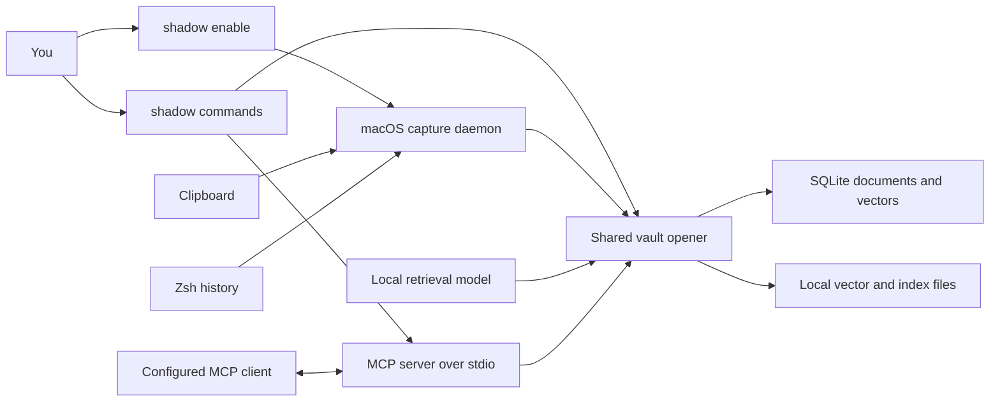
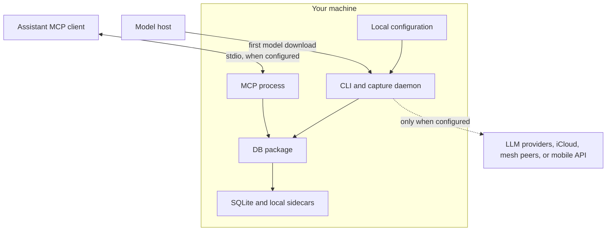

# How LatticeShadow fits together

LatticeShadow has two packages. **`latticeshadow-cli`** is the macOS client: commands, an optional capture daemon, a menu-bar interface, and an MCP server. **`latticeshadow-db`** is the reusable Python store underneath it. The DB package can be installed on its own, including on Linux; it does not need the macOS client to exist.

For a first run, the short path is `shadow remember` → `shadow search`. No background process is required. The longer path is there when you ask for it.

## The ordinary path

1. `shadow remember <type> <text>` adds a typed event. `shadow search <query>` embeds a query and retrieves matches; `shadow timeline` reads recent events. These operations open the vault directly, so the daemon can be stopped.
2. The CLI uses a pinned 128-dimensional [Static Retrieval MRL](https://huggingface.co/sentence-transformers/static-retrieval-mrl-en-v1) model on the local CPU. The first use downloads that model. Its revision, identity, and dimension are recorded with the collection so old or different vectors cannot be silently mixed. The DB library can instead use an embedding function supplied by its caller.
3. The DB package stores document records, metadata, vector blobs, and collection metadata in SQLite. It also maintains local vector files for search; selected experimental index modes create additional sidecars. Treat the database *and* its neighboring files as sensitive data. A copied `.sqlite` file alone is not a general backup plan.
4. `shadow install` prepares a macOS launch agent. `shadow enable` starts it; `shadow disable` stops it. Once running, the daemon polls the clipboard and newly appended Zsh history and writes events through the same vault. Optional ambient app context is a separate setting. Background capture is convenient, but a clipboard is a remarkably efficient way to collect things you did not mean to archive.

The client normally writes under `~/.latticeshadow/` (`shadow.sqlite`, configuration, key material, and auxiliary files). The launch agent lives under `~/Library/LaunchAgents/`. The paths can differ when iCloud sync is enabled or tests substitute temporary storage.

## Storage and privacy boundaries

The CLI opens its main `clipboard` collection with privacy mode enabled. Document text is encrypted at rest with AES-GCM, and a wrapped key is stored in SQLite. Embeddings pass through a distance-preserving rotation, then the default main collection stores searchable FlyHash bitmasks. The optional dense hot collection stores rotated vectors. FlyHash can expose approximate similarity, and rotated dense vectors preserve geometry; neither is opaque vector encryption. IDs, timestamps, metadata, and auxiliary files have different exposure properties from encrypted document text. Do not put secrets in metadata expecting the document encryption guarantee to cover them.

The optional `clipboard_hot` collection mirrors events into a dense streaming-exact index. It is off by default. Other DB index modes, quantization, cross-model alignment, holographic recall, autonomous repair, and peer proofs are research features. In particular, the P2P proof code simulates a proof shape; it does not implement a zk-SNARK. Names in research code are allowed to dream bigger than the guarantees.

`shadow mcp serve` is a local **stdio** JSON-RPC process, not a network listener. An MCP client must be configured to launch it. The exposed tools can recall and summarize memory, report privacy state, create repair proposals, and delete named events with explicit confirmation. Responses apply pattern-based redaction to event text and string metadata. Redaction can miss secrets, and the assistant client may have its own remote boundary; decide what to connect before handing it access to your memory.

The core save/search path does not require a hosted inference API. The model download needs network access once. Mesh sync and the mobile API are off by default; enabling them starts listeners. iCloud sync and remote LLM providers are optional and can move data outside this machine. Some LLM-assisted commands also probe a local LM Studio endpoint when no provider is configured. Review [configuration and capture guidance](../packages/cli/README.md) before enabling those paths.

## Where to look in the code

| Question | Start here |
| --- | --- |
| Command behavior and daemon lifecycle | [`shadow_cli.py`](../packages/cli/latticeshadow/shadow_cli.py) |
| Clipboard and terminal polling | [`shadowd.py`](../packages/cli/latticeshadow/shadowd.py), [`history_watcher.py`](../packages/cli/latticeshadow/history_watcher.py) |
| Model and main/hot vault settings | [`vaults.py`](../packages/cli/latticeshadow/vaults.py) |
| Event types, timeline, and search mapping | [`timeline.py`](../packages/cli/latticeshadow/timeline.py) |
| MCP tools, resources, and transport | [`mcp_server.py`](../packages/cli/latticeshadow/mcp_server.py) |
| DB entry point and storage | [`latticedb/__init__.py`](../packages/db/latticeshadow_db/latticedb/__init__.py), [`collection.py`](../packages/db/latticeshadow_db/latticedb/collection.py), [`store.py`](../packages/db/latticeshadow_db/latticedb/store.py) |
| Privacy implementation and limitations | [`privacy.py`](../packages/db/latticeshadow_db/latticedb/privacy.py), [privacy overview](../README.md#privacy-plainly) |

For setup, start with the [root README](../README.md). For current gaps and priorities, see the [improvement backlog](SPRINT.md).
